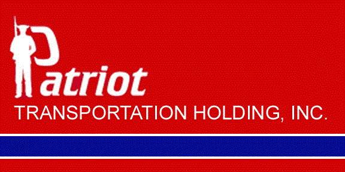

    

    

 Patriot Transportation Holding, Inc., is a publicly traded company that is listed on the Nasdaq Stock Market. Patriot Transportation Holding, Inc., stock is traded under the symbol of _PATI_. All filings with the Securities and Exchange Commission are available under the [Investor Relations](investor-relations.html)
 
 Edward L. Baker - Chairman Emeritus

 Thompson S. Baker II - Chairman

 John D. Milton, Jr. - General Council and Secretary and Treasurer

 Rob Sandlin - Chief Executive Officer and President

 Matt McNulty - Chief Financial Officer and Vice President

 John Wagner - Chief Information Officer and Vice President

 John D. Klopfenstein - Chief Accounting Officer
 
 Jeff Anthony - Vice President of Human Resources